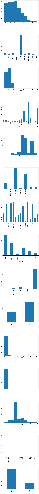
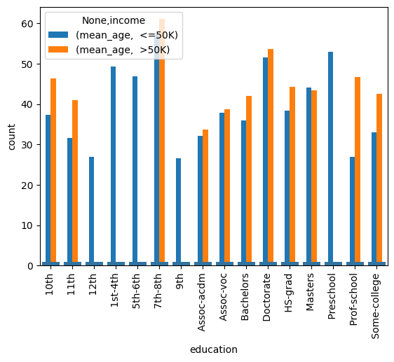
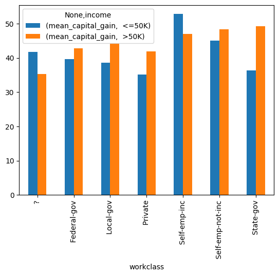

# Adult dataset

For the Final Project, we will do statistical analysis on the Census Income dataset available at the UC
Irvine Machine Learning Repository.

Here is the information on the dataset:
- Dataset Characteristics: Multivariate
- Subject Area: Social Science
- Associated Tasks: Classification
- Feature Type: Categorical, Integer
- No. of Instances: 48842
- No. of Features: 14


```python
# import libraries

import pandas as pd
from matplotlib import gridspec
import math
import matplotlib.pyplot as plt
import random
import numpy as np
import seaborn as sns

# columns of interest
column_names = [
    'age',
    'workclass',
    'fnlwgt',
    'education',
    'education-num',
    'marital-status',
    'occupation',
    'relationship',
    'race',
    'sex',
    'capital-gain',
    'capital-loss',
    'hours-per-week',
    'native-country',
    'income',
]

# read data
df = pd.read_csv('adult/adult.data', names=column_names)

# get smaller chunk of data if desired
do_split = True
if do_split:
    df_shuffled = df.sample(frac=1,random_state = 51)
    result = np.array_split(df_shuffled, 50)
    data = result[0]
    n = data.shape[0]
    data.index = range(0,n)
else:
    data = df
```

    /usr/local/lib/python3.11/site-packages/numpy/core/fromnumeric.py:59: FutureWarning: 'DataFrame.swapaxes' is deprecated and will be removed in a future version. Please use 'DataFrame.transpose' instead.
      return bound(*args, **kwds)


```python
# get information about the size of the dataset
data.head()
```


<div>
<style scoped>
    .dataframe tbody tr th:only-of-type {
        vertical-align: middle;
    }

    .dataframe tbody tr th {
        vertical-align: top;
    }

    .dataframe thead th {
        text-align: right;
    }
</style>
<table border="1" class="dataframe">
  <thead>
    <tr style="text-align: right;">
      <th></th>
      <th>age</th>
      <th>workclass</th>
      <th>fnlwgt</th>
      <th>education</th>
      <th>education-num</th>
      <th>marital-status</th>
      <th>occupation</th>
      <th>relationship</th>
      <th>race</th>
      <th>sex</th>
      <th>capital-gain</th>
      <th>capital-loss</th>
      <th>hours-per-week</th>
      <th>native-country</th>
      <th>income</th>
    </tr>
  </thead>
  <tbody>
    <tr>
      <th>0</th>
      <td>40</td>
      <td>Private</td>
      <td>225432</td>
      <td>Some-college</td>
      <td>10</td>
      <td>Married-civ-spouse</td>
      <td>Machine-op-inspct</td>
      <td>Husband</td>
      <td>White</td>
      <td>Male</td>
      <td>0</td>
      <td>0</td>
      <td>45</td>
      <td>United-States</td>
      <td>&lt;=50K</td>
    </tr>
    <tr>
      <th>1</th>
      <td>32</td>
      <td>Self-emp-not-inc</td>
      <td>420895</td>
      <td>Bachelors</td>
      <td>13</td>
      <td>Married-civ-spouse</td>
      <td>Sales</td>
      <td>Husband</td>
      <td>White</td>
      <td>Male</td>
      <td>0</td>
      <td>0</td>
      <td>47</td>
      <td>United-States</td>
      <td>&lt;=50K</td>
    </tr>
    <tr>
      <th>2</th>
      <td>42</td>
      <td>Private</td>
      <td>175935</td>
      <td>HS-grad</td>
      <td>9</td>
      <td>Divorced</td>
      <td>Transport-moving</td>
      <td>Not-in-family</td>
      <td>White</td>
      <td>Male</td>
      <td>0</td>
      <td>1980</td>
      <td>46</td>
      <td>United-States</td>
      <td>&lt;=50K</td>
    </tr>
    <tr>
      <th>3</th>
      <td>35</td>
      <td>Private</td>
      <td>172186</td>
      <td>Some-college</td>
      <td>10</td>
      <td>Separated</td>
      <td>Craft-repair</td>
      <td>Not-in-family</td>
      <td>White</td>
      <td>Male</td>
      <td>0</td>
      <td>0</td>
      <td>40</td>
      <td>United-States</td>
      <td>&lt;=50K</td>
    </tr>
    <tr>
      <th>4</th>
      <td>30</td>
      <td>Private</td>
      <td>220939</td>
      <td>Assoc-voc</td>
      <td>11</td>
      <td>Divorced</td>
      <td>Exec-managerial</td>
      <td>Not-in-family</td>
      <td>White</td>
      <td>Male</td>
      <td>0</td>
      <td>0</td>
      <td>40</td>
      <td>United-States</td>
      <td>&lt;=50K</td>
    </tr>
  </tbody>
</table>
</div>


```python
# split into test and train data
train, test = train_test_split(data, test_size=0.2)
```


```python
# look at training data
train.head()
```


<div>
<style scoped>
    .dataframe tbody tr th:only-of-type {
        vertical-align: middle;
    }

    .dataframe tbody tr th {
        vertical-align: top;
    }

    .dataframe thead th {
        text-align: right;
    }
</style>
<table border="1" class="dataframe">
  <thead>
    <tr style="text-align: right;">
      <th></th>
      <th>age</th>
      <th>workclass</th>
      <th>fnlwgt</th>
      <th>education</th>
      <th>education-num</th>
      <th>marital-status</th>
      <th>occupation</th>
      <th>relationship</th>
      <th>race</th>
      <th>sex</th>
      <th>capital-gain</th>
      <th>capital-loss</th>
      <th>hours-per-week</th>
      <th>native-country</th>
      <th>income</th>
    </tr>
  </thead>
  <tbody>
    <tr>
      <th>642</th>
      <td>21</td>
      <td>Private</td>
      <td>434102</td>
      <td>Some-college</td>
      <td>10</td>
      <td>Never-married</td>
      <td>Adm-clerical</td>
      <td>Not-in-family</td>
      <td>White</td>
      <td>Female</td>
      <td>0</td>
      <td>0</td>
      <td>40</td>
      <td>United-States</td>
      <td>&lt;=50K</td>
    </tr>
    <tr>
      <th>512</th>
      <td>33</td>
      <td>Local-gov</td>
      <td>100734</td>
      <td>HS-grad</td>
      <td>9</td>
      <td>Divorced</td>
      <td>Tech-support</td>
      <td>Not-in-family</td>
      <td>White</td>
      <td>Female</td>
      <td>0</td>
      <td>0</td>
      <td>55</td>
      <td>United-States</td>
      <td>&lt;=50K</td>
    </tr>
    <tr>
      <th>620</th>
      <td>33</td>
      <td>Private</td>
      <td>529104</td>
      <td>11th</td>
      <td>7</td>
      <td>Married-civ-spouse</td>
      <td>Handlers-cleaners</td>
      <td>Husband</td>
      <td>White</td>
      <td>Male</td>
      <td>0</td>
      <td>0</td>
      <td>50</td>
      <td>United-States</td>
      <td>&lt;=50K</td>
    </tr>
    <tr>
      <th>640</th>
      <td>49</td>
      <td>State-gov</td>
      <td>122177</td>
      <td>Some-college</td>
      <td>10</td>
      <td>Married-civ-spouse</td>
      <td>Machine-op-inspct</td>
      <td>Husband</td>
      <td>White</td>
      <td>Male</td>
      <td>0</td>
      <td>0</td>
      <td>40</td>
      <td>United-States</td>
      <td>&gt;50K</td>
    </tr>
    <tr>
      <th>297</th>
      <td>34</td>
      <td>Private</td>
      <td>137900</td>
      <td>HS-grad</td>
      <td>9</td>
      <td>Never-married</td>
      <td>Sales</td>
      <td>Not-in-family</td>
      <td>White</td>
      <td>Female</td>
      <td>0</td>
      <td>0</td>
      <td>35</td>
      <td>United-States</td>
      <td>&lt;=50K</td>
    </tr>
  </tbody>
</table>
</div>


```python
# look at test data
test.head()
```


<div>
<style scoped>
    .dataframe tbody tr th:only-of-type {
        vertical-align: middle;
    }

    .dataframe tbody tr th {
        vertical-align: top;
    }

    .dataframe thead th {
        text-align: right;
    }
</style>
<table border="1" class="dataframe">
  <thead>
    <tr style="text-align: right;">
      <th></th>
      <th>age</th>
      <th>workclass</th>
      <th>fnlwgt</th>
      <th>education</th>
      <th>education-num</th>
      <th>marital-status</th>
      <th>occupation</th>
      <th>relationship</th>
      <th>race</th>
      <th>sex</th>
      <th>capital-gain</th>
      <th>capital-loss</th>
      <th>hours-per-week</th>
      <th>native-country</th>
      <th>income</th>
    </tr>
  </thead>
  <tbody>
    <tr>
      <th>0</th>
      <td>40</td>
      <td>Private</td>
      <td>225432</td>
      <td>Some-college</td>
      <td>10</td>
      <td>Married-civ-spouse</td>
      <td>Machine-op-inspct</td>
      <td>Husband</td>
      <td>White</td>
      <td>Male</td>
      <td>0</td>
      <td>0</td>
      <td>45</td>
      <td>United-States</td>
      <td>&lt;=50K</td>
    </tr>
    <tr>
      <th>73</th>
      <td>42</td>
      <td>Private</td>
      <td>42703</td>
      <td>HS-grad</td>
      <td>9</td>
      <td>Divorced</td>
      <td>Adm-clerical</td>
      <td>Unmarried</td>
      <td>White</td>
      <td>Female</td>
      <td>0</td>
      <td>0</td>
      <td>40</td>
      <td>United-States</td>
      <td>&lt;=50K</td>
    </tr>
    <tr>
      <th>402</th>
      <td>64</td>
      <td>?</td>
      <td>178724</td>
      <td>HS-grad</td>
      <td>9</td>
      <td>Married-civ-spouse</td>
      <td>?</td>
      <td>Wife</td>
      <td>White</td>
      <td>Female</td>
      <td>0</td>
      <td>0</td>
      <td>20</td>
      <td>United-States</td>
      <td>&lt;=50K</td>
    </tr>
    <tr>
      <th>184</th>
      <td>26</td>
      <td>Private</td>
      <td>117833</td>
      <td>Bachelors</td>
      <td>13</td>
      <td>Never-married</td>
      <td>Exec-managerial</td>
      <td>Not-in-family</td>
      <td>White</td>
      <td>Female</td>
      <td>0</td>
      <td>1669</td>
      <td>50</td>
      <td>United-States</td>
      <td>&lt;=50K</td>
    </tr>
    <tr>
      <th>207</th>
      <td>60</td>
      <td>Self-emp-not-inc</td>
      <td>25825</td>
      <td>HS-grad</td>
      <td>9</td>
      <td>Divorced</td>
      <td>Craft-repair</td>
      <td>Not-in-family</td>
      <td>White</td>
      <td>Male</td>
      <td>0</td>
      <td>0</td>
      <td>50</td>
      <td>United-States</td>
      <td>&gt;50K</td>
    </tr>
  </tbody>
</table>
</div>


```python
# Plotting function for discrete variables

import math

def discrete_plots(df, columns, num_cols):
    n_plots = len(columns)
    n_cols = num_cols
    n_rows = int(math.ceil(n_plots/n_cols))
    gs = gridspec.GridSpec(n_rows, n_cols)
    fig = plt.figure(figsize=(8,100))
    for i in range(n_plots):
        ax = fig.add_subplot(gs[i])
        if df.dtypes[columns[i]] != 'int64':
            df[columns[i]].value_counts().sort_index().plot(kind='bar', ax=ax)
        else:
            df[columns[i]].hist(ax=ax, grid=False) 
        ax.set_xlabel(columns[i])
    fig.tight_layout()
    fig.supylabel('Count')
    plt.show()

discrete_plots(test_data,column_names,1)
```


    

    


```python
# plot barplot grouped by education and income

plt.figure()
data.groupby(['education','income']).agg(mean_age=('age', 'mean')).unstack().plot.bar()
sns.countplot(data['age'])
plt.figure()
data.groupby(['workclass','income']).agg(mean_capital_gain=('age', 'mean')).unstack().plot.bar()

```


    <Axes: xlabel='workclass'>


    <Figure size 640x480 with 0 Axes>


    

    


    <Figure size 640x480 with 0 Axes>


    

    


```python
data['age'].max()
```


    90


```python
test_data.shape[0]
```


    6512


```python

```
