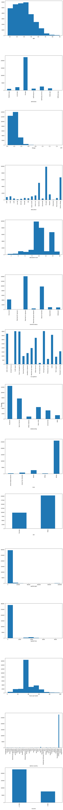
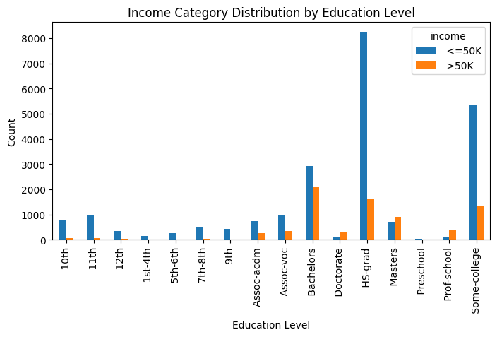
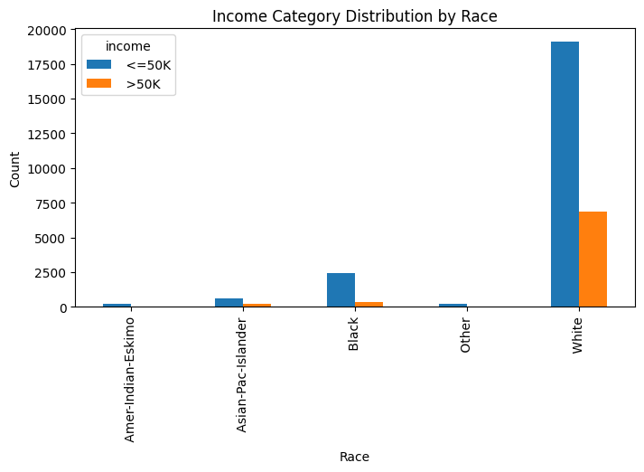
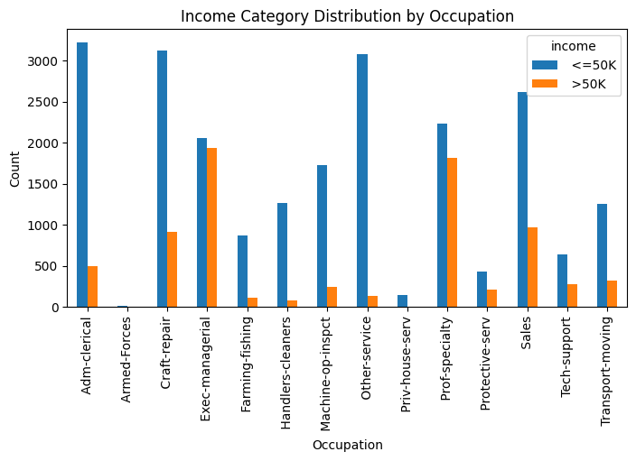
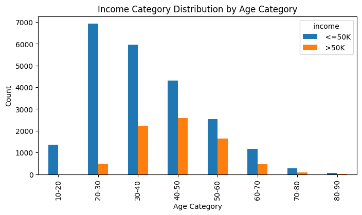
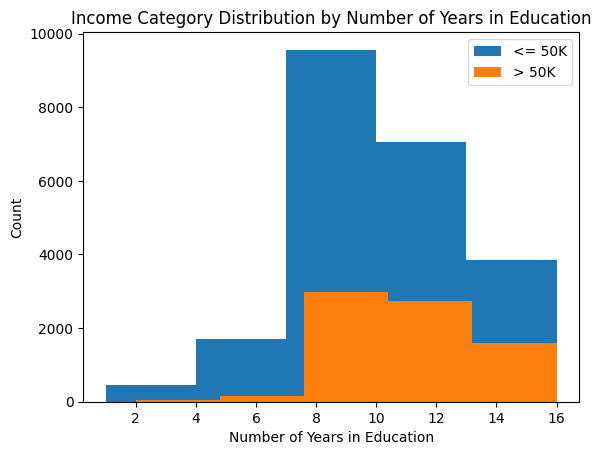

# Adult dataset

For the Final Project, we will do statistical analysis on the Census Income dataset available at the UC
Irvine Machine Learning Repository.

Here is the information on the dataset:
- Dataset Characteristics: Multivariate
- Subject Area: Social Science
- Associated Tasks: Classification
- Feature Type: Categorical, Integer
- No. of Instances: 48842
- No. of Features: 14


```python
# import libraries

import pandas as pd
from matplotlib import gridspec
import math
import matplotlib.pyplot as plt
import random
import numpy as np
import seaborn as sns
from sklearn.model_selection import train_test_split
from scipy import stats
from sklearn.svm import SVC
from sklearn.preprocessing import OneHotEncoder
from sklearn.compose import ColumnTransformer
from sklearn.pipeline import Pipeline
from sklearn.metrics import accuracy_score, classification_report
from sklearn.linear_model import LogisticRegression
from sklearn.metrics import classification_report


# columns of interest
column_names = [
    'age',
    'workclass',
    'fnlwgt',
    'education',
    'education-num',
    'marital-status',
    'occupation',
    'relationship',
    'race',
    'sex',
    'capital-gain',
    'capital-loss',
    'hours-per-week',
    'native-country',
    'income',
]

# read data
df = pd.read_csv('adult/adult.data', names=column_names)

# get smaller chunk of data if desired
do_split = False
if do_split:
    df_shuffled = df.sample(frac=1,random_state = 51)
    result = np.array_split(df_shuffled, 50)
    data = result[0]
    n = data.shape[0]
    data.index = range(0,n)
else:
    data = df

```


```python
# data cleanup

# initial data shape
print(data.shape)

# replace missing values
data.replace("?", np.NaN, inplace=True)
data.replace(" ?", np.NaN, inplace=True)

# data preprocessing
# drop rows with missing values
data.dropna(inplace=True)

# final data shape
print(data.shape)

```

    (32561, 15)
    (30162, 15)


```python
# get information about the size of the dataset
data.head()
```


<div>
<style scoped>
    .dataframe tbody tr th:only-of-type {
        vertical-align: middle;
    }

    .dataframe tbody tr th {
        vertical-align: top;
    }

    .dataframe thead th {
        text-align: right;
    }
</style>
<table border="1" class="dataframe">
  <thead>
    <tr style="text-align: right;">
      <th></th>
      <th>age</th>
      <th>workclass</th>
      <th>fnlwgt</th>
      <th>education</th>
      <th>education-num</th>
      <th>marital-status</th>
      <th>occupation</th>
      <th>relationship</th>
      <th>race</th>
      <th>sex</th>
      <th>capital-gain</th>
      <th>capital-loss</th>
      <th>hours-per-week</th>
      <th>native-country</th>
      <th>income</th>
    </tr>
  </thead>
  <tbody>
    <tr>
      <th>0</th>
      <td>39</td>
      <td>State-gov</td>
      <td>77516</td>
      <td>Bachelors</td>
      <td>13</td>
      <td>Never-married</td>
      <td>Adm-clerical</td>
      <td>Not-in-family</td>
      <td>White</td>
      <td>Male</td>
      <td>2174</td>
      <td>0</td>
      <td>40</td>
      <td>United-States</td>
      <td>&lt;=50K</td>
    </tr>
    <tr>
      <th>1</th>
      <td>50</td>
      <td>Self-emp-not-inc</td>
      <td>83311</td>
      <td>Bachelors</td>
      <td>13</td>
      <td>Married-civ-spouse</td>
      <td>Exec-managerial</td>
      <td>Husband</td>
      <td>White</td>
      <td>Male</td>
      <td>0</td>
      <td>0</td>
      <td>13</td>
      <td>United-States</td>
      <td>&lt;=50K</td>
    </tr>
    <tr>
      <th>2</th>
      <td>38</td>
      <td>Private</td>
      <td>215646</td>
      <td>HS-grad</td>
      <td>9</td>
      <td>Divorced</td>
      <td>Handlers-cleaners</td>
      <td>Not-in-family</td>
      <td>White</td>
      <td>Male</td>
      <td>0</td>
      <td>0</td>
      <td>40</td>
      <td>United-States</td>
      <td>&lt;=50K</td>
    </tr>
    <tr>
      <th>3</th>
      <td>53</td>
      <td>Private</td>
      <td>234721</td>
      <td>11th</td>
      <td>7</td>
      <td>Married-civ-spouse</td>
      <td>Handlers-cleaners</td>
      <td>Husband</td>
      <td>Black</td>
      <td>Male</td>
      <td>0</td>
      <td>0</td>
      <td>40</td>
      <td>United-States</td>
      <td>&lt;=50K</td>
    </tr>
    <tr>
      <th>4</th>
      <td>28</td>
      <td>Private</td>
      <td>338409</td>
      <td>Bachelors</td>
      <td>13</td>
      <td>Married-civ-spouse</td>
      <td>Prof-specialty</td>
      <td>Wife</td>
      <td>Black</td>
      <td>Female</td>
      <td>0</td>
      <td>0</td>
      <td>40</td>
      <td>Cuba</td>
      <td>&lt;=50K</td>
    </tr>
  </tbody>
</table>
</div>


```python
# Plotting function for discrete variables

import math

def discrete_plots(df, columns, num_cols):
    n_plots = len(columns)
    n_cols = num_cols
    n_rows = int(math.ceil(n_plots/n_cols))
    gs = gridspec.GridSpec(n_rows, n_cols)
    fig = plt.figure(figsize=(8,100))
    for i in range(n_plots):
        ax = fig.add_subplot(gs[i])
        if df.dtypes[columns[i]] != 'int64':
            df[columns[i]].value_counts().sort_index().plot(kind='bar', ax=ax)
        else:
            df[columns[i]].hist(ax=ax, grid=False) 
        ax.set_xlabel(columns[i])
    fig.tight_layout()
    fig.supylabel('Count')
    plt.show()

discrete_plots(data,column_names,1)
```


    

    


## Features affecting income level

We consider the following features which can potentially affect the income level.

1. Education
2. Race
3. Occupation
4. Age Category (age divided into bins of 10)
5. Number of years in education

The corresponding barplots are shown below.


```python
# Group the data by education level and income category
education_income_counts = data.groupby(['education', 'income']).size().unstack()

# Grouped bar plot
education_income_counts.plot(kind='bar', stacked=False, figsize=(8, 4))

# Add labels and title
plt.title('Income Category Distribution by Education Level')
plt.xlabel('Education Level')
plt.ylabel('Count')
```


    Text(0, 0.5, 'Count')


    

    


```python
# Group the data by race and income category
race_income_counts = data.groupby(['race', 'income']).size().unstack()

# Grouped bar plot
race_income_counts.plot(kind='bar', stacked=False, figsize=(8, 4))

# Add labels and title
plt.title('Income Category Distribution by Race')
plt.xlabel('Race')
plt.ylabel('Count')
```


    Text(0, 0.5, 'Count')


    

    


```python
# Group the data by occupation and income category
occupation_income_counts = data.groupby(['occupation', 'income']).size().unstack()

# Grouped bar plot
occupation_income_counts.plot(kind='bar', stacked=False, figsize=(8, 4))

# Add labels and title
plt.title('Income Category Distribution by Occupation')
plt.xlabel('Occupation')
plt.ylabel('Count')
```


    Text(0, 0.5, 'Count')


    

    


```python
# converting age to categorical data

print('Min age = ', np.min(data['age']))
print('Max age = ', np.max(data['age']))      

bins = [10,20,30,40,50,60,70,80,90]
labels = ['10-20','20-30','30-40','40-50','50-60','60-70','70-80','80-90']

data['age_category'] = pd.cut(data['age'], bins=bins, labels=labels, right=False)

data.head()
```

    Min age =  17
    Max age =  90


<div>
<style scoped>
    .dataframe tbody tr th:only-of-type {
        vertical-align: middle;
    }

    .dataframe tbody tr th {
        vertical-align: top;
    }

    .dataframe thead th {
        text-align: right;
    }
</style>
<table border="1" class="dataframe">
  <thead>
    <tr style="text-align: right;">
      <th></th>
      <th>age</th>
      <th>workclass</th>
      <th>fnlwgt</th>
      <th>education</th>
      <th>education-num</th>
      <th>marital-status</th>
      <th>occupation</th>
      <th>relationship</th>
      <th>race</th>
      <th>sex</th>
      <th>capital-gain</th>
      <th>capital-loss</th>
      <th>hours-per-week</th>
      <th>native-country</th>
      <th>income</th>
      <th>age_category</th>
    </tr>
  </thead>
  <tbody>
    <tr>
      <th>0</th>
      <td>39</td>
      <td>State-gov</td>
      <td>77516</td>
      <td>Bachelors</td>
      <td>13</td>
      <td>Never-married</td>
      <td>Adm-clerical</td>
      <td>Not-in-family</td>
      <td>White</td>
      <td>Male</td>
      <td>2174</td>
      <td>0</td>
      <td>40</td>
      <td>United-States</td>
      <td>&lt;=50K</td>
      <td>30-40</td>
    </tr>
    <tr>
      <th>1</th>
      <td>50</td>
      <td>Self-emp-not-inc</td>
      <td>83311</td>
      <td>Bachelors</td>
      <td>13</td>
      <td>Married-civ-spouse</td>
      <td>Exec-managerial</td>
      <td>Husband</td>
      <td>White</td>
      <td>Male</td>
      <td>0</td>
      <td>0</td>
      <td>13</td>
      <td>United-States</td>
      <td>&lt;=50K</td>
      <td>50-60</td>
    </tr>
    <tr>
      <th>2</th>
      <td>38</td>
      <td>Private</td>
      <td>215646</td>
      <td>HS-grad</td>
      <td>9</td>
      <td>Divorced</td>
      <td>Handlers-cleaners</td>
      <td>Not-in-family</td>
      <td>White</td>
      <td>Male</td>
      <td>0</td>
      <td>0</td>
      <td>40</td>
      <td>United-States</td>
      <td>&lt;=50K</td>
      <td>30-40</td>
    </tr>
    <tr>
      <th>3</th>
      <td>53</td>
      <td>Private</td>
      <td>234721</td>
      <td>11th</td>
      <td>7</td>
      <td>Married-civ-spouse</td>
      <td>Handlers-cleaners</td>
      <td>Husband</td>
      <td>Black</td>
      <td>Male</td>
      <td>0</td>
      <td>0</td>
      <td>40</td>
      <td>United-States</td>
      <td>&lt;=50K</td>
      <td>50-60</td>
    </tr>
    <tr>
      <th>4</th>
      <td>28</td>
      <td>Private</td>
      <td>338409</td>
      <td>Bachelors</td>
      <td>13</td>
      <td>Married-civ-spouse</td>
      <td>Prof-specialty</td>
      <td>Wife</td>
      <td>Black</td>
      <td>Female</td>
      <td>0</td>
      <td>0</td>
      <td>40</td>
      <td>Cuba</td>
      <td>&lt;=50K</td>
      <td>20-30</td>
    </tr>
  </tbody>
</table>
</div>


```python
# Group the data by age and income category
age_income_counts = data.groupby(['age_category', 'income'], observed=False).size().unstack()

# Grouped bar plot
age_income_counts.plot(kind='bar', stacked=False, figsize=(8, 4))

# Add labels and title
plt.title('Income Category Distribution by Age Category')
plt.xlabel('Age Category')
plt.ylabel('Count')
```


    Text(0, 0.5, 'Count')


    

    


```python
grouped_data = {}
for category, values in zip(data['income'], data['education-num']):
    grouped_data.setdefault(category, []).append(values)

# Plotting histogram for each category
plt.figure()
for category, values in grouped_data.items():
    plt.hist(values, bins=5, label=category)

# Add labels and title
plt.title('Income Category Distribution by Number of Years in Education')
plt.legend(['<= 50K','> 50K'])
plt.xlabel('Number of Years in Education')
plt.ylabel('Count')
```


    Text(0, 0.5, 'Count')


    

    


# Value Counts

The code below shows the value counts for each of the independent variables we have considered above for the statistical analysis.


```python
# income counts
income_counts = data['income'].value_counts()
# sorting income count by descending order
income_counts_sorted = income_counts.sort_values(ascending=False)
# display the sorted income levels and their counts
print(income_counts_sorted)

# ---------------

# education counts
education_counts = data['education'].value_counts()
# sorting education count by descending order
education_counts_sorted = education_counts.sort_values(ascending=False)
# display the sorted education levels and their counts
print(education_counts_sorted)

# ---------------

# race counts
race_counts = data['race'].value_counts()
# sorting race count by descending order
race_counts_sorted = race_counts.sort_values(ascending=False)
# display the sorted race and their counts
print(race_counts_sorted)

# ---------------

# occupation counts
occupation_counts = data['occupation'].value_counts()
# sorting occupation count by descending order
occupation_counts_sorted = occupation_counts.sort_values(ascending=False)
# display the sorted occupation and their counts
print(occupation_counts_sorted)

# ---------------

# age category counts
age_counts = data['age_category'].value_counts()
# sorting occupation count by descending order
age_counts_sorted = age_counts.sort_values(ascending=False)
# display the sorted occupation and their counts
print(age_counts_sorted)

```

    income
     <=50K    22654
     >50K      7508
    Name: count, dtype: int64
    education
     HS-grad         9840
     Some-college    6678
     Bachelors       5044
     Masters         1627
     Assoc-voc       1307
     11th            1048
     Assoc-acdm      1008
     10th             820
     7th-8th          557
     Prof-school      542
     9th              455
     12th             377
     Doctorate        375
     5th-6th          288
     1st-4th          151
     Preschool         45
    Name: count, dtype: int64
    race
     White                 25933
     Black                  2817
     Asian-Pac-Islander      895
     Amer-Indian-Eskimo      286
     Other                   231
    Name: count, dtype: int64
    occupation
     Prof-specialty       4038
     Craft-repair         4030
     Exec-managerial      3992
     Adm-clerical         3721
     Sales                3584
     Other-service        3212
     Machine-op-inspct    1966
     Transport-moving     1572
     Handlers-cleaners    1350
     Farming-fishing       989
     Tech-support          912
     Protective-serv       644
     Priv-house-serv       143
     Armed-Forces            9
    Name: count, dtype: int64
    age_category
    30-40    8211
    20-30    7415
    40-50    6900
    50-60    4185
    60-70    1634
    10-20    1369
    70-80     357
    80-90      56
    Name: count, dtype: int64


# Correlation Analysis

In this section, we perform a correlation analysis between the potential independent variables we considered above and the dependent variable. After the analysis, we have decided that we will excluding the 'race' variable since the correlation is very small.


```python
# import library
from scipy.stats import chi2_contingency

def cramers_v(x, y):
    confusion_matrix = pd.crosstab(x, y)
    chi2 = chi2_contingency(confusion_matrix)[0]
    n = confusion_matrix.sum().sum()
    phi2 = chi2 / n
    r, k = confusion_matrix.shape
    phi2corr = max(0, phi2 - ((k-1)*(r-1))/(n-1))
    rcorr = r - ((r-1)**2)/(n-1)
    kcorr = k - ((k-1)**2)/(n-1)
    return np.sqrt(phi2corr / min((kcorr-1), (rcorr-1)))


correlation_education = cramers_v(data['education'], data['income'])
print(f"Correlation with Education: {correlation_education:.4f}")

correlation_race = cramers_v(data['race'], data['income'])
print(f"Correlation with Race: {correlation_race:.4f}")

correlation_occupation = cramers_v(data['occupation'], data['income'])
print(f"Correlation with Occupation: {correlation_occupation:.4f}")

correlation_age_category = cramers_v(data['age_category'], data['income'])
print(f"Correlation with Age Category: {correlation_age_category:.3f}")

correlation_education_num = cramers_v(data['education-num'], data['income'])
print(f"Correlation with Number of Years in Education: {correlation_education_num:.4f}")

```

    Correlation with Education: 0.3667
    Correlation with Race: 0.0998
    Correlation with Occupation: 0.3490
    Correlation with Age Category: 0.308
    Correlation with Number of Years in Education: 0.3667


```python
mean_hours = np.mean(df['hours-per-week'])
std_hours = np.std(df['hours-per-week'])

print("Mean hours-per-week = %.2f" % mean_hours)
print("Standard Deviation hours-per-week = %.2f" % std_hours)
```

    Mean hours-per-week = 40.93
    Standard Deviation hours-per-week = 11.98


# Machine learning:

We have used the following five classifiers for our analysis:
- Support Vector Machine Classifier
- Logistic Regression
- Decision Tree Classifier
- Random Forest Classifier
- Gradient Boosting Classifier

Out initial consideration are the following features:

1. Education
2. Race
3. Occupation
4. Age Category (age divided into bins of 10)
5. Education Number (number of years spent in education)

We split the dataset into 80% for train and 20% for test. The training data consists of X_train and y_train, and the test data consists of X_test and y_test.

After training the classifiers using X_train and Y_train, we test it using X_test and y_test.

The classification report for each classifier are printed as the end of each code cell. All of the classifiers have very similar performance.


```python
# SVC Classifier

# Get X and y
X = pd.get_dummies(data[['education', 'occupation', 'age_category', 'education-num']])
y = data['income']

# Split data into training and testing sets
np.random.seed(123)
X_train, X_test, y_train, y_test = train_test_split(X, y, test_size=0.2, random_state=42)

svc = SVC(random_state=42)
svc.fit(X_train, y_train)

# Predict
y_pred = svc.predict(X_test)

# Classification report
report = classification_report(y_test, y_pred)
print(report)

```

                  precision    recall  f1-score   support
    
           <=50K       0.82      0.93      0.87      4503
            >50K       0.65      0.39      0.49      1530
    
        accuracy                           0.79      6033
       macro avg       0.73      0.66      0.68      6033
    weighted avg       0.78      0.79      0.77      6033
    


```python
# Logistic Regression

logistic = LogisticRegression(random_state=42, max_iter = 10000)
logistic.fit(X_train, y_train)

# Predict
y_pred = logistic.predict(X_test)

# Classification report
report = classification_report(y_test, y_pred)
print(report)

```

                  precision    recall  f1-score   support
    
           <=50K       0.82      0.93      0.87      4503
            >50K       0.66      0.39      0.49      1530
    
        accuracy                           0.79      6033
       macro avg       0.74      0.66      0.68      6033
    weighted avg       0.78      0.79      0.78      6033
    


```python
# import library
from sklearn.tree import DecisionTreeClassifier

# Initializing and training the Decision Tree Classifier
dt_classifier = DecisionTreeClassifier(random_state=42)
dt_classifier.fit(X_train, y_train)

# Making predictions
y_pred = dt_classifier.predict(X_test)

# Evaluating the model
# accuracy = accuracy_score(y_test, y_pred)
# print(f'Decision Tree Classifier Accuracy: {accuracy}')

# Classification report
report = classification_report(y_test, y_pred)
print(report)
```

                  precision    recall  f1-score   support
    
           <=50K       0.82      0.93      0.87      4503
            >50K       0.65      0.41      0.50      1530
    
        accuracy                           0.79      6033
       macro avg       0.74      0.67      0.69      6033
    weighted avg       0.78      0.79      0.78      6033
    


```python
# Random Forest Classifier
from sklearn.ensemble import RandomForestClassifier

# Initializing and training the Random Forest Classifier
rf_classifier = RandomForestClassifier(n_estimators=100, random_state=42)
rf_classifier.fit(X_train, y_train)

# Making predictions
y_pred = rf_classifier.predict(X_test)

# Evaluating the model
# accuracy_rf = accuracy_score(y_test, y_pred_rf)
# print(f'Random Forest Classifier Accuracy: {accuracy_rf}')

# Classification report
report = classification_report(y_test, y_pred)
print(report)

```

                  precision    recall  f1-score   support
    
           <=50K       0.82      0.92      0.87      4503
            >50K       0.65      0.41      0.50      1530
    
        accuracy                           0.79      6033
       macro avg       0.73      0.67      0.68      6033
    weighted avg       0.78      0.79      0.78      6033
    


```python
# Gradient Boosting Machines Classifer

from sklearn.ensemble import GradientBoostingClassifier

# Initializing and training the GBM Classifier
gbm_classifier = GradientBoostingClassifier(n_estimators=100, learning_rate=0.1, random_state=42)
gbm_classifier.fit(X_train, y_train)

# Making predictions
y_pred = gbm_classifier.predict(X_test)

# Evaluating the model
# accuracy_gbm = accuracy_score(y_test, y_pred_gbm)
# print(f'Gradient Boosting Machines Classifier Accuracy: {accuracy_gbm}')

# Classification report
report = classification_report(y_test, y_pred)
print(report)

```

                  precision    recall  f1-score   support
    
           <=50K       0.83      0.92      0.87      4503
            >50K       0.64      0.43      0.51      1530
    
        accuracy                           0.79      6033
       macro avg       0.74      0.67      0.69      6033
    weighted avg       0.78      0.79      0.78      6033
    


```python

```
